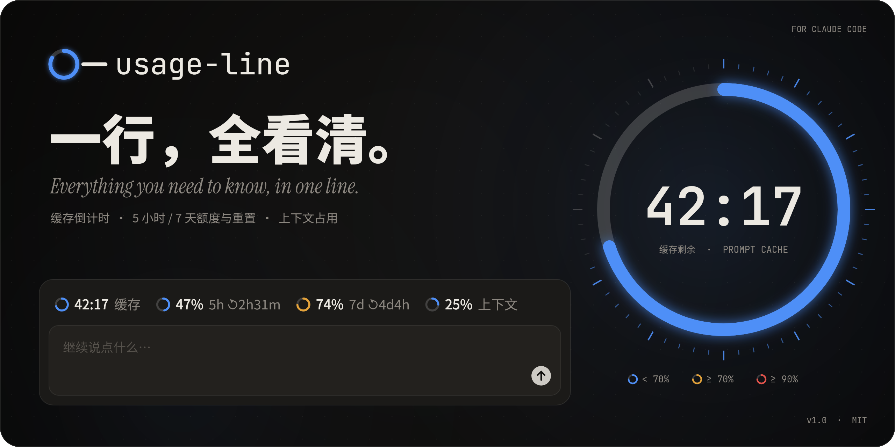

<p align="center">
  
</p>

<p align="center">
  <b>Everything you need to know, in one line.</b> A Claude Code plugin that shows the prompt-cache countdown,<br>
  5-hour and 7-day usage with their resets, and context fill as native-looking rings in one slim row above the prompt.
</p>

<p align="center">
  <a href="README.md">中文</a> · <a href="assets/usage-line-trailer.mp4">▶ Launch trailer (39 s)</a> · <a href="assets/usage-line.mp4">2D film (44 s)</a>
</p>

---

## What it shows

```
◕ 42:17 缓存   ◑ 47% 5h ↻2h31m   ◕ 74% 7d ↻4d5h   ◔ 25% 上下文
```

| Ring | Meaning | Detail |
| --- | --- | --- |
| **缓存** (cache) | Time left on the prompt cache | `mm:ss`, to the second; amber in the last minute, red `过期` (expired) after |
| **5h** | Five-hour window used | `↻2h54m` is the time until it resets |
| **7d** | Seven-day window used | `↻4d5h` is the time until it resets |
| **上下文** (context) | Context window fill | Read again after `/clear` and compaction |

Rings are blue below 70%, **amber from 70%** and **red from 90%**. The labels are in Chinese for now.

## Install

In Claude Code:

```
/plugin marketplace add sundyme/usage-line
/plugin install usage-line@usage-line
```

Or from a shell:

```bash
claude plugin marketplace add sundyme/usage-line
```

```bash
claude plugin install usage-line@usage-line
```

## Where it shows

- **Desktop and VS Code**: a row directly above the prompt, with SVG rings. In a narrow window it drops the reset countdowns first, then the labels, keeping rings and numbers; it never squeezes or truncates. It steps aside while a survey is shown.
- **Terminal**: the same row, on its own line directly above the prompt, with `○ ◔ ◑ ◕ ●` in the ring colours. A narrow terminal drops the reset countdowns, then the labels, and past that the row wraps rather than hides.

## How the cache countdown works

Claude Code does not tell plugins when the cache expires, so usage-line works it out from the requests:

- Every main-thread model request reads, and so refreshes, the conversation's prompt cache; the countdown restarts then. A **subagent's** requests have a cache of their own and leave it alone.
- A request counts only when its response actually read or wrote the cache; a failed or uncached request puts the countdown back.
- Subscriptions cache for **1 hour**; requests on extra usage past a spent window cache for **5 minutes**, which the plugin detects on its own.
- A model switch clears the countdown (the cache is per model) and adopts the TTL Claude Code reports; a resumed session picks the countdown up from its last response.

## Settings

| Option | Default | |
| --- | --- | --- |
| `cacheTtl` | `1h` | The base TTL, `1h` or `5m`. Keep `1h` on a subscription; overage is detected automatically. Change it with `/plugin configure usage-line@usage-line`. |

## Requirements and limits

- Built on Claude Code's **function hooks** plugin API (early access; needs a recent Claude Code, verified on 2.1.28x). Interactive sessions have it on; a non-interactive run such as `claude -p` needs `CLAUDE_CODE_ENABLE_FUNCTION_HOOKS=1`.
- The usage windows come from Claude Code; with an API key instead of a subscription there are none, and those rings read `–`.
- The cache countdown is an estimate and can differ from when the server actually evicts the cache.

## Development

```bash
claude plugin validate plugins/usage-line
```

```bash
CLAUDE_CODE_ENABLE_FUNCTION_HOOKS=1 claude plugin test plugins/usage-line
```

Try a change with `claude --plugin-dir plugins/usage-line`.

## The launch films

The 39-second 3D trailer lives in [`trailer/`](trailer/). Each shot is a [three.js](https://threejs.org) scene rendered on the GPU in headless Chrome. Claude Code's own interface is drawn flat, the way the app draws it. The film's motion elements use a hand-written liquid-glass shader: it frosts what sits behind and bends it only in a narrow lip at the rim, where it also splits into colour. It adds a hairline highlight. Shapes melt into one another, so a message bubble can flow into the cache lens. The type is a screen-locked layer redrawn every sub-frame, so it gets the same real motion blur as the 3D. A compositing shader handles the transitions: iris, zoom-through, push, mosaic, glitch, blur-zoom and flash. Each frame then goes through bloom, an 8-sub-frame motion-blur accumulation and a light grade. The storyboard and copy are in [`trailer/STORYBOARD.md`](trailer/STORYBOARD.md). Raw pixels stream over a WebSocket into ffmpeg from four pages in parallel. [`trailer/score.py`](trailer/score.py) synthesises a 120 BPM electronic score with numpy alone, and every cut and UI event gets a sound on its own frame.

The 44-second 2D film is in [`film/`](film/). No editor, no templates, no footage. [`film/render.mjs`](film/render.mjs) draws all 2,640 frames with Skia, averaging six sub-frames across a 180° shutter for real motion blur, and pipes raw pixels into ffmpeg. [`film/score.py`](film/score.py) synthesises the score and every sound effect with numpy alone, each UI sound on the frame of its event.

## License

[MIT](LICENSE). usage-line is a community plugin, not affiliated with Anthropic.
