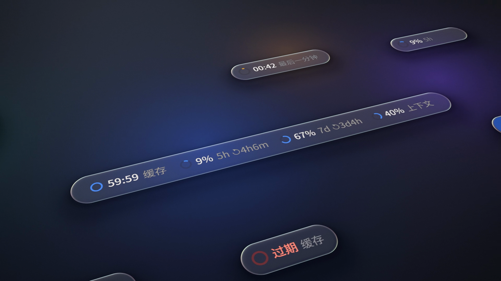

<p align="center">
  
</p>

<p align="center">
  <b>一行，全看清。</b> Claude Code 插件：提示词缓存倒计时、5 小时 / 7 天额度与重置时间、上下文占用，<br>
  以原生风格的进度圆环，排成输入框上方细细的一行。
</p>

<p align="center">
  <a href="https://github.com/sundyme/usage-line/actions/workflows/ci.yml"></a>
  <a href="LICENSE"></a>
  <a href="README.en.md"></a>
</p>

<p align="center">
  <a href="assets/usage-line-trailer.mp4"></a><br>
  <sub>▶ 点击观看 39 秒 3D 发布预告片（<a href="trailer/">trailer/</a>） · 另有 44 秒的 <a href="assets/usage-line.mp4">透视版影片</a>（<a href="film/BRIEF.md">简报</a>） · 每一帧与每一个音符都由代码生成</sub>
</p>

---

## 它显示什么

```
◕ 42:17 缓存   ◑ 47% 5h ↻2h31m   ◕ 74% 7d ↻4d5h   ◔ 25% 上下文
```

| 圆环 | 含义 | 细节 |
| --- | --- | --- |
| **缓存** | 提示词缓存还剩多久过期 | `mm:ss` 逐秒倒计时；最后一分钟变琥珀色，过期显示红色「过期」 |
| **5h** | 5 小时额度已用百分比 | `↻2h54m` 是距离重置的时间 |
| **7d** | 7 天额度已用百分比 | `↻4d5h` 是距离重置的时间 |
| **上下文** | 上下文窗口占用 | `/clear`、压缩之后自动重读 |

圆环颜色：低于 70% 为蓝色，**≥ 70%** 琥珀色，**≥ 90%** 红色。

## 安装

在 Claude Code 里：

```
/plugin marketplace add sundyme/usage-line
/plugin install usage-line@usage-line
```

或者在终端：

```bash
claude plugin marketplace add sundyme/usage-line
```

```bash
claude plugin install usage-line@usage-line
```

更新：`claude plugin marketplace update usage-line`，然后 `claude plugin update usage-line@usage-line`。

## 在哪里显示

- **桌面端 / VS Code**：输入框正上方的一行，带 SVG 圆环。窗口变窄时先收起重置倒计时，再收起文字标签，只留圆环和数字；从不挤压、截断。出现问卷时自动让位。
- **终端**：同样在输入框正上方独占一行，用 `○ ◔ ◑ ◕ ●` 表示进度，颜色与圆环一致。窗口变窄时先收起重置倒计时，再收起标签，再窄就换行，不会被隐藏。

## 缓存倒计时是怎么算的

Claude Code 不直接告诉插件缓存何时过期，usage-line 根据请求本身推算：

- 主线程每次发出模型请求，都会读取并刷新对话的提示词缓存，倒计时从那一刻重新开始；**子代理**的请求有自己的缓存，不影响倒计时。
- 只有响应里确实读写了缓存（`cache_read` / `cache_creation` 大于 0）才算数；请求失败或没有缓存时，倒计时回到上一次。
- 订阅的缓存时长是 **1 小时**；当某个额度窗口已用满、按超额用量计费时，缓存时长是 **5 分钟**，插件会自动识别。
- 切换模型时会清空倒计时（缓存按模型分开），并采用 Claude Code 报告的 TTL；恢复（resume）会话时，按上次响应的时间接着算。

## 设置

| 选项 | 默认 | 说明 |
| --- | --- | --- |
| `cacheTtl` | `1h` | 缓存时长基准，`1h` 或 `5m`。订阅保持 `1h`；超额时插件会自动按 5 分钟算，无需改动。 |

默认即可；修改用 `/plugin configure usage-line@usage-line`。

## 要求与限制

- 基于 Claude Code 的 **function hooks** 插件接口（早期功能，需较新的 Claude Code，已在 2.1.28x 上验证）。交互式会话默认启用；`claude -p` 等非交互运行需要设置 `CLAUDE_CODE_ENABLE_FUNCTION_HOOKS=1`。
- 额度数据来自 Claude Code 本身；使用 API Key 而非订阅时没有 5h / 7d 额度，对应圆环显示 `–`。
- 缓存倒计时是推算值，与服务端实际的缓存淘汰可能有出入。
- 界面文案目前为中文。

## 开发

```
.claude-plugin/marketplace.json   本仓库即插件市场
plugins/usage-line/               插件本体
  hooks/register.tsx              全部逻辑（约 300 行）
  types/index.d.ts                $.state 的类型契约
  tests/usage-line.test.ts        18 个测试
trailer/                          3D 发布预告片的源码（three.js）
film/                             影片的简报、配乐与 banner 源码（v1 的 2D 渲染器也在这里）
assets/                           banner、海报、影片
```

```bash
claude plugin validate plugins/usage-line
```

```bash
CLAUDE_CODE_ENABLE_FUNCTION_HOOKS=1 claude plugin test plugins/usage-line
```

本地试用改动：`claude --plugin-dir plugins/usage-line`。Claude Code 加载插件时会在 `plugins/usage-line/.claude-plugin/types/` 写出接口类型，之后可以用 `tsc -p plugins/usage-line --noEmit` 做严格类型检查。

## 发布影片是怎么做的

没有剪辑软件，没有模板和素材。44 秒的影片按 [`film/BRIEF.md`](film/BRIEF.md) 的分镜，在预告片同一套 three.js 引擎里渲染（[`trailer/src/film2.js`](trailer/src/film2.js) 及 `f2*.js`）。每块界面都是透视相机拍摄的 3D 平面，因此有真实的运镜与视差；转场都在镜头内完成：圆环接圆环、窗口翻面成终端、从对勾处展开光圈。v1 的 2D 版本仍在 [`film/render.mjs`](film/render.mjs)（Skia 逐帧绘制）。音乐是一段 [ElevenLabs](https://elevenlabs.io) 生成的 120 BPM 纯器乐，[`film/fit_music.py`](film/fit_music.py) 在它的 drop 上找到小节线，只在整乐句处剪辑，让 drop 落在镜头冲进缓存圆环的第 16 秒、收尾和弦落在片尾。[`film/score.py`](film/score.py) 只用 numpy 合成全部音效（噪声扫频、正弦重击、读秒滴答、打字声和卷积混响），每一个 UI 音效都对齐画面里的那一帧，音乐在音效下自动让位；不给 `MUSIC` 时它也能合成整段配乐。

```bash
cd film && npm install && python3 score.py && node render.mjs
```

39 秒的 3D 预告片在 [`trailer/`](trailer/)：每个镜头是一个 [three.js](https://threejs.org) 场景，在无头 Chrome 里用 GPU 渲染。片中 Claude Code 自己的界面按 App 原样画成平面。影片的动态元素用的是自写的液态玻璃着色器：先把背后的画面多级模糊，只在边缘一圈很窄的弧面上折射并分出色散虹彩，再加一条发丝高光。几块玻璃之间可以平滑融合，所以一条消息气泡能流进缓存镜片。大字是逐帧重绘的屏幕层，与 3D 画面一起获得真实的运动模糊；转场（光圈、穿越变焦、推移、马赛克、故障、模糊缩放、闪白）是一个合成着色器，之后依次经过 bloom、8 个子帧的运动模糊累积和调色；原始像素经 WebSocket 送进 ffmpeg，4 个页面并行渲染。[`trailer/score.py`](trailer/score.py) 同样只用 numpy，合成 120 BPM 的电子配乐（抗锯齿超级锯齿波和弦、侧链、贝斯、琶音、两次 drop，缓存过期时音乐会停下），每一次切换和界面事件都有落在同一帧上的音效。分镜与文案见 [`trailer/STORYBOARD.md`](trailer/STORYBOARD.md)。

```bash
cd trailer && npm install && python3 score.py && node render.mjs
```

## 许可

[MIT](LICENSE)。usage-line 是社区插件，与 Anthropic 无关联。
